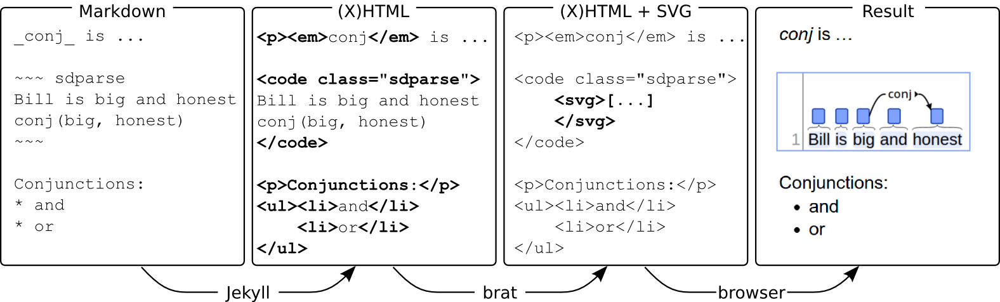

This is a page of documentation created using the Annodoc
system. It serves a double purpose as *documentation* for the Annodoc
system and as a *template* that you can use as a starting point for
creating your own documentation using annodoc.

## Table of contents

* [What is Annodoc?](#what-is-annodoc)
* [How does it work?](#how-does-it-work)
* [Getting started](#getting-started)
* [Editing documents](#editing-documents)
* [Adding documents](#adding-documents)
* [Visualizations](#visualizations)
* [Collections](#collections)
* [Configuration](#configuration)
* [Troubleshooting](#troubleshooting)

## What is Annodoc?

Annodoc is a documentation support system focusing in particular on
guidelines for text annotation. The system combines ease of editing
using a simple plain-text like format with support for the
visualization of complex, structured text annotation and close
integration with version control.

A brief
[introduction of Annodoc](http://www2.lingfil.uu.se/SLTC2014/abstracts/sltc2014_submission_32.pdf)
[PDF] was recently presented at
[SLTC'14](http://www2.lingfil.uu.se/SLTC2014/).

For example, consider the following fragment of documentation

<div class="documentation-example" markdown="1">
Mentions of person names are annotated as [PERSON]()

~~~ ann
Barack Obama is the current president.
T1 PERSON 0 12 Barack Obama
~~~

<span style="float:right;font-size:75%;opacity:0.5">(Not seeing a visualization above? See <a href="#troubleshooting">troubleshooting</a>)</span>

</div>

this example is generated from the following input:

    Mentions of person names are annotated as [PERSON]()

    ~~~ ann
    Barack Obama is the current president.
    T1 PERSON 0 12 Barack Obama
    ~~~

## How does it work?

The text content of Annodoc documents is in the simple [Markdown]
format (with the option to include HTML), and the data for the
visualizations is represented in any of a number of supported
annotation formats such as [Stanford dependency], [CoNLL-X], 
[CoNLL-U], or [.ann standoff].

The final documents seen in the browser are a combination of (X)HTML
and [SVG] for the visualizations. The primary tools for generating the
final documents from the source are the [Jekyll] static web site
generator, which converts Markdown into (X)HTML, and the [brat]
annotation tool, which generates the SVG visualizations, with help
from some Annodoc-specific extensions.

The following figure shows the primary stages of processing.



In addition to Markdown processing, Jekyll provides numerous other
features such as document collection management as well as templating
and simple scripting using the [Liquid] language, and Annodoc provides
various facilities for supporting guideline development such as
automatic linking of defined types.

Finally, to support the development and maintenance of complex sets of
documentation, Annodoc features close integration with the [Git]
distributed version control system through the [GitHub] web-based
hosting service, allowing automatic conversion and publication of the
most recent version of the online documentation each time the sources
are updated.

For more information on these technologies, please see the following:

* Jekyll: <http://jekyllrb.com/>
* brat: <http://brat.nlplab.org>
* Markdown: <http://daringfireball.net/projects/markdown/>
* Kramdown (Markdown superset): <http://kramdown.gettalong.org/>
* Liquid: <http://wiki.shopify.com/Liquid>
* Stanford Dependency format: <http://nlp.stanford.edu/software/stanford-dependencies.shtml>
* CoNLL-X format: <http://ilk.uvt.nl/conll/#dataformat>
* CoNLL-U format: <http://universaldependencies.github.io/docs/format.html>
* .ann standoff format: <http://brat.nlplab.org/standoff.html>
* Git: <http://git-scm.com/>
* GitHub: <http://github.com>

## Getting started

First, you need to get a copy of the Annodoc system. If you don't have
one already, head over to the online [Annodoc repository] and
download, clone or fork the repository. The former two options
(download or clone) will give you a local copy of the system (see
[running locally](#running-locally) below), while cloning the
repository can allow you to work within the online version control
system (see [working online](#working-online)).

To **download** the system source, navigate to the [Annodoc
repository] and click on the `Download ZIP` link on the right-hand
toolbar. You should then unpack the downloaded `.zip` file in an
appropriate location and move to the directory with the source.  For
the next steps, see [running locally](#running-locally) below.

To **clone** the system, you will need the [Git] version control
system. After making sure that Git is available, navigate to the
[Annodoc repository] and copy the "clone URL" from the right-hand
toolbar. Then, run the command `git clone <URL>`, where `<URL>` is the
clone URL copied previously. Finally, move to the cloned directory and
see [running locally](#running-locally) below for the next steps.

To **fork** the system, you will need a GitHub account. Then, while
logged in to GitHub, navigate to the [Annodoc repository] and click on
the `Fork` button on the top right. This will give you a copy of the
repository that you can work on in GitHub. You can then download or
clone this copy, as above, to [run the system
locally](#running-locally), or [work online](#working-online) (see
below).

### Running locally

**Please note**: the Annodoc system has been developed and tested in a
linux environment and has so far not been specifically tested on
Windows.  We strongly recommend a Unix or workalike system (OSX or
linux) for running the system locally.

For running Annodoc locally, you will need to have a recent version of
[Jekyll]. In particular, version 2.0 or greater is required for
[collection](#collections) features.

After getting a local copy of the system (see [Getting
started](#getting-started) above), you can build the site from sources
and serve the resulting documents by navigating to the directory with
annodoc sources and using the command

```
jekyll serve --watch
```

(here, the option `--watch` specifies that Jekyll should watch the
source documents for changes and rebuild the site when there are any.)

If the above command runs successfully, you should see something like
the following:

<pre><code>$ jekyll serve --watch
            Source: .
       Destination: ./_site
      Generating... done.
 Auto-regeneration: enabled
    Server address: http://0.0.0.0:4000/
  Server running... press ctrl-c to stop.</code></pre>

Here, the value `Server address` (commonly `http://0.0.0.0:4000/`) is
a URL where Jekyll is serving the site from. You should be able to see
the documentation by navigating to this address using your browser.
If you do not see the documentation at this address, please see
[troubleshooting](#troubleshooting) below.

### Working online

In addition to running Jekyll locally (see [running
locally](#running-locally)), it is possible to use the Annodoc system
entirely online, relying on the facilities of [GitHub] (or a
workalike) for generating the site from source using Jekyll. The
following assumes that the repository is stored in [GitHub] unless
separately mentioned.

GitHub provides website hosting with Jekyll support through [GitHub
pages](https://pages.github.com/). Using GitHub pages with a GitHub
repository is largely automatic: simply make sure that the source
documents are held in the `gh-pages` branch of your repository, and
the processed final documents will be automatically made available at
`http://username.github.io/repository`, where `username` is your
GitHub username and `repository` is the name of the repository.

**Note:** GitHub pages are publicly visible even for private GitHub
repositories.

For further information setting up GitHub pages, please refer to the
documentation at <https://pages.github.com/>.

## Editing documents

You can either edit source documents directly in your favorite text
editor, or via a simple online interface.

### Editing locally

If you have a local copy of an Annodoc system (see [Getting
started](#getting-started) above), you can edit any of the source
documents directly, using any text editor.

Most typically, changes are made to one or more Markdown (`.md`)
files. To see the effect of these changes in the final documentation,
the source needs to be processed through Jekyll. (see [Running
locally](#running-locally); note that this processing is automatic
with the `--watch` option).

If you are working with Git for version control, you should commit and
push your changes to the Git repository when you are done, e.g. by
running the following

    git commit DOCUMENT.md
    git push

(where `DOCUMENT.md` is the name of the changed document.)

Alternatively, you can run `git commit -a` to commit all changed
documents.

### Editing online

If you are working with a repository stored in GitHub (or similar),
you can use online editing features.

**Please note**: the "edit page" link will only appear if the
`editurl` site variable is set in `_config.yml` (see
[Configuration](#configuration)). Please make sure that your
configuration is correctly set up to use these features.

When configured for online editing, the header of each Annodoc
documentation page will contain an "edit page" link that leads to the
[GitHub] online editing page, shown in the following:


This feature allows version-controlled documents to be edited directly
from your browser. To get started, the only relevant parts are the
large black edit area and the "Cancel" and "Commit changes" buttons at
the bottom.

To give this a quick try, click on the following link: [edit sandbox
document]({{ site.editurl }}/sandbox.md).  This should open a
"sandbox" document in a new tab. (If this does not work, please see
[troubleshooting](#troubleshooting) below.) After testing it out, feel
free to either cancel without saving your changes, or save them into
the version control system using the "Commit changes" button. You can
see the resulting document here (reload to see changes, and please
note it may take some time for the changes to show up.)

For experimenting with the system, we recommend using the sandbox
document instead of any "real" documents.

To edit the actual documentation, first find the page you're
interested in. Then,

* Click on the "edit page" link on the top
* Make your changes in the GitHub editor
* (Optional: add a message describing your changes in the "Commit changes" box)
* Click on "Commit changes"

Finally, wait a moment for your revisions to the documentation to be
compiled (normally no more than 10 seconds) and reload the
documentation page to make sure they look right.

## Adding documents

To add new documents into the system, simply create a new `.md`
document and add the following front matter at the beginning of the
document:

    ---
    layout: entry
    title: DOCUMENT-TITLE
    ---

(where `DOCUMENT-TITLE` is the title you wish to give to the
document.)

This [YAML] front matter is required for Jekyll to identify the
document as markdown.

If you are using the GitHub (or similar), you can create new documents
simply by clicking on the `+` sign at the top or the repository file
listing.

If you are working locally with Git for version control, you can
create new documents with any text editor and then add newly created
documents to the Git repository, e.g. by running the following
commands:

    git add DOCUMENT.md
    git commit
    git push

(where `DOCUMENT.md` is the name of the new document.)

## Visualizations

As explained in the section [what is annodoc?](#what-is-annodoc),
visualizations are created using a simple syntax that identifies a
section of the document as being annotation in some particular format.
The system then replaces these sections with the corresponding
visualizations.

This section provides examples of various ways to create
visualizations.

### Visualization basics

There are a number of ways to add visualizations into a document.  The
most straightforward one is to wrap annotations in a format `FORMAT`
with the lines `~~~ FORMAT` (before) and `~~~` (after). For example,

    ~~~ ann
    Barack Obama is the current president.
    T1 PERSON 0 12 Barack Obama
    ~~~

gives the following visualization:

~~~ ann
Barack Obama is the current president.
T1 PERSON 0 12 Barack Obama
~~~

Above, the `FORMAT` value `ann` specifies that the source content is
in the [.ann standoff] format. Currently, the following formats are
supported:

* .ann standoff format: <http://brat.nlplab.org/standoff.html>
* Stanford Dependency format: <http://nlp.stanford.edu/software/stanford-dependencies.shtml>
* CoNLL-X format: <http://ilk.uvt.nl/conll/#dataformat>
* CoNLL-U format: <http://universaldependencies.github.io/docs/format.html>

Some more simple examples follow.

A single tree in the Stanford Dependency format can be embedded using
the following syntax:

    ~~~ sdparse
    Dogs run
    nsubj(run, Dogs)
    ~~~

which results in this embedded visualization:

~~~ sdparse
Dogs run
nsubj(run, Dogs)
~~~

Parses represented in the CoNLL-X format can be embedded as illustrated
by the following example:

    ~~~ conllx
    1    Dogs   dog    _    NNS    _    2    nsubj
    2    run    run    _    VBP    _    0    ROOT
    ~~~

gives

~~~ conllx
1    Dogs   dog    _    NNS    _    2    nsubj
2    run    run    _    VBP    _    0    ROOT
~~~

Finally, parses in the CoNLL-U format can be embedded as shown below:

    ~~~ conllu
    1    They    they    PRON    PRN    Case=Nom|Num=Plur            2    nsubj    _    _
    2    buy     buy     VERB    VBP    Num=Plur|Per=3|Tense=Pres    0    root     _    _
    3    books   book    NOUN    NNS    Num=Plur                     2    dobj     _    _
    ~~~

resulting in

~~~ conllu
1    They    they    PRON    PRN    Case=Nom|Num=Plur            2    nsubj    _    _
2    buy     buy     VERB    VBP    Num=Plur|Per=3|Tense=Pres    0    root     _    _
3    books   book    NOUN    NNS    Num=Plur                     2    dobj     _    _
~~~

The remainder of this section provides further details for each
supported format and additional information on options for embedding
visualizations.

### .ann standoff format

This section provides information on the .ann standoff (Ann) format.
For full documentation, please refer to
<http://brat.nlplab.org/standoff.html>.

#### Ann format: annotation primitives

The following example illustrates some of the basic Ann format
annotation primitives that are supported in visualizations. The
annotation

    ~~~ ann
    Sony formed a joint venture with Ericsson, a company based in Sweden.
    T1 Organization 0 4	Sony
    T2 MERGE-ORG 14 27	joint venture
    T3 Organization 33 41	Ericsson
    E1 MERGE-ORG:T2 Org1:T1 Org2:T3
    T4 Country 62 68	Sweden
    R1 Origin Arg1:T3 Arg2:T4
    A1 Name T4
    ~~~

is visualized as follows:

~~~ ann
Sony formed a joint venture with Ericsson, a company based in Sweden.
T1 Organization 0 4	Sony
T2 MERGE-ORG 14 27	joint venture
T3 Organization 33 41	Ericsson
E1 MERGE-ORG:T2 Org1:T1 Org2:T3
T4 Country 62 68	Sweden
R1 Origin Arg1:T3 Arg2:T4
A1 Name T4
~~~

This example involves *text-bound* annotations, an *attribute*
annotation, an *event* annotation, and a *relation* annotation. All
annotations occupy a single line of the input and begin with a unique
identifier. The remaining structure varies depending on the annotation
primitive.

#### Ann format: text-bound annotations

Text-bound annotations identify a span of text using `(start, end)`
offsets and assign it a type (note that the marked text is repeated
for reference):

    T1 Organization 0 4	Sony
    T2 MERGE-ORG 14 27	joint venture
    T3 Organization 33 41	Ericsson
    T4 Country 75 81	Sweden

Text-bound annotations can be used, for example, to mark mentions of
specific named entities in text (`Sony`, `Ericsson` and `Sweden`
above) or the "triggers" of event annotations (`joint venture`).

In addition to simple `(start, end)` spans, discontinuous span
annotations are also supported using the syntax `START END[;START
END[...]]`. For example,

    ~~~ ann
    Barack and Michelle Obama
    T1 PERSON 0 6;20 25 Barack Obama
    T2 PERSON 11 19 Michelle
    ~~~

gives

~~~ ann
Barack and Michelle Obama
T1 PERSON 0 6;20 25 Barack Obama
T2 PERSON 11 19 Michelle
~~~

#### Ann format: attribute annotations

Attribute annotation associate either a binary flag (e.g. `IsName`) or
a key-value pair (e.g. `Tense`, `Past`) with another annotation, such
as an entity mention (textbound) or an event annotation.

    A1 IsName T4
    A2 Tense E1 Past

#### Ann format: relation annotations

Relation annotations relate two other annotations and have a type
(e.g. `Origin`).

    R1 Origin Arg1:T3 Arg2:T4

#### Ann format: event annotations

Event annotations associate any number of annotations in specific
roles (e.g. `Theme`, `Cause`), identifying the event with a type
(e.g. `MERGE-ORG`) and a textbound annotation expressing it in text.

    E1 MERGE-ORG:T2 Org1:T1 Org2:T3

#### Ann format: other annotation primitives

The [.ann standoff] format additionally supports equivalence
relations, normalization annotations and comment (or note)
annotations. These annotation primitives are presently not supported
in Annodoc.

### Stanford Dependency format

This section provides details on the Stanford Dependency (SD) format.

#### SD format basics

Basic SD format visualizations consist of a single line of text
followed by any number of typed dependencies between words using the
simple format `TYPE(FROM, TO)`. For example, the input

    ~~~ sdparse
    The quick brown fox jumped
    det(fox-4, The-1)
    amod(fox-4, quick-2)
    amod(fox-4, brown-3)
    nsubj(jumped-5, fox-4)
    ~~~

gives

~~~ sdparse
The quick brown fox jumped
det(fox-4, The-1)
amod(fox-4, quick-2)
amod(fox-4, brown-3)
nsubj(jumped-5, fox-4)
~~~

#### SD format: ambiguous tokens

If your example has several instances of the same token, you can use
their position to refer to the exact token. In the following example
`can-5` refers to the fifth token of the sentence, `can`.

    ~~~ sdparse
    I can can the can .
    nsubj(can-3, I)
    aux(can-3, can-2)
    det(can-5,the)
    dobj(can-3,can-5)
    punct(can-3,.)
    ~~~

will result in this visualization

~~~ sdparse
I can can the can .
nsubj(can-3, I)
aux(can-3, can-2)
det(can-5,the)
dobj(can-3,can-5)
punct(can-3,.)
~~~

#### SD format: part-of-speech tags

Part-of-speech (POS) tags are optional and use the format `text/POS`.

    ~~~ sdparse
    POS/NNP tags/NNS can/MD be/VB attached/VBN to/TO tokens/NNS ./.
    nn(tags, POS)
    nsubjpass(attached, tags)
    aux(attached, can)
    auxpass(attached, be)
    prep(attached, to)
    pobj(to, tokens)
    ~~~

~~~ sdparse
POS/NNP tags/NNS can/MD be/VB attached/VBN to/TO tokens/NNS ./.
nn(tags, POS)
nsubjpass(attached, tags)
aux(attached, can)
auxpass(attached, be)
prep(attached, to)
pobj(to, tokens)
~~~

If the source text contains any literal slashes (`/`), these can be
escaped using backslash.

     ~~~ sdparse
     \\/\\ escapes/VBZ :/: \\o\//\\o\/
     nsubj(escapes, \)
     ~~~

~~~ sdparse
\\/\\ escapes/VBZ :/: \\o\//\\o\/
nsubj(escapes, \)
~~~

### Multiple lines of text

The literal sequence `\n` in the SD input text is interpreted as a
newline. (This sequence should be separated by space from the rest of
the input.)

    ~~~ sdparse
    One line \n and another.
    ~~~

gives:

~~~ sdparse
One line \n and another.
~~~

### CoNLL-X format

This section provides information on the visualization of the CoNLL-X
format.

#### CoNLL-X format basics

The [CoNLL-X] format is a format for representing dependency parses,
developed as a variant of previous related formats for the 2006
CoNLL-X shared task on multi-lingual dependency parsing.

Each line in the CoNLL-X format specifies information relating to one
token (or word). For example, the following defines two words

    ~~~ conllx
    1    Dogs   dog    _    NNS    _    2    nsubj    _    _
    2    run    run    _    VBP    _    0    ROOT     _    _
    ~~~

visualized as

~~~ conllx
1    Dogs   dog    _    NNS    _    2    nsubj    _    _
2    run    run    _    VBP    _    0    ROOT     _    _
~~~

The definitions of the various space-separated fields are provided
in the following.

#### CoNLL-X format field definitions

The CoNLL-X format defines 10 fields separated by space (strictly TAB
characters in the original definition):

1. ID: Token counter, starting at 1 for each new sentence.
2. FORM: Word form or punctuation symbol.
3. LEMMA: Lemma or stem of word form.
4. CPOSTAG: Coarse-grained part-of-speech tag.
5. POSTAG: Fine-grained part-of-speech tag.
6. FEATS: Unordered set of syntactic and/or morphological features.
7. HEAD: Head of the current token.
8. DEPREL: Dependency relation to the HEAD.
9. PHEAD: Projective head of current token.
10. PDEPREL: Dependency relation to the PHEAD.

The current implementation of the visualization only uses the `ID`,
`FORM`, `CPOSTAG`, `HEAD` and `DEPREL` attributes.

### CoNLL-U format

This section provides information on the visualization of the [CoNLL-U]
format.

#### CoNLL-U format basics

The CoNLL-U format is a format for representing dependency parses,
developed in the 
[Universal Dependencies](universaldependencies.github.io/docs/)
project as a revision of the CoNLL-X format.

Most lines in CoNLL-U format specify the annotation of a single word
or token. The format uses blank lines to separate sentences (as in
CoNLL-X), and allows also comment lines beginning with the hash
character (`#`). The following example illustrates these:

    ~~~ conllu
    # this is one sentence
    1    Dogs   dog    NOUN    NNS    _    2    nsubj    _    _
    2    run    run    VERB    VBP    _    0    ROOT     _    _
    
    # this is a second sentence
    1    Cats   cat    NOUN    NNS    _    2    nsubj    _    _
    2    sleep  sleep  VERB    VBP    _    0    ROOT     _    _
    ~~~

~~~ conllu
# this is one sentence
1    Dogs   dog    NOUN    NNS    _    2    nsubj    _    _
2    run    run    VERB    VBP    _    0    ROOT     _    _

# this is a second sentence
1    Cats   cat    NOUN    NNS    _    2    nsubj    _    _
2    sleep  sleep  VERB    VBP    _    0    ROOT     _    _
~~~

#### CoNLL-U format field definitions

The CoNLL-U format defines 10 fields separated by space (strictly TAB
characters in the original definition):

 1. ID: Word index, integer starting at 1 for each new sentence; may be a range for tokens with multiple words.
 2. FORM: Word form or punctuation symbol.
 3. LEMMA: Lemma or stem of word form.
 4. CPOSTAG: Google universal part-of-speech tag from the [universal POS tag](http://universaldependencies.github.io/docs/u/pos/index.html) set.
 5. POSTAG: Language-specific part-of-speech tag; underscore if not available.
 6. FEATS: List of morphological features from the [universal feature inventory](http://universaldependencies.github.io/docs/u/feat/index.html) or from a defined language-specific extension; underscore if not available.
 7. HEAD: Head of the current token, which is either a value of ID or zero (0).
 8. DEPREL: [Universal Stanford dependency relation](http://universaldependencies.github.io/docs/u/dep/index.html) to the HEAD (root iff HEAD = 0) or a defined language-specific subtype of one.
 9. DEPS: List of secondary dependencies (head-deprel pairs).
10. MISC: Any other annotation.

For the complete documentation on the CoNLL-U format, please see
<http://universaldependencies.github.io/docs/format.html>.

### Alternative visualization syntaxes

As an alternative to the `~~~` syntax, you can use the equivalent HTML
tag form, where the format specification appears as the value of the
`class` attribute. For example,

    <div class="sdparse">
    Dogs run
    nsubj(run, Dogs)
    </div>

gives

<div class="sdparse">
Dogs run
nsubj(run, Dogs)
</div>

This form is more flexible in allowing e.g. additional attributes
to control aspects of the visualization. For example,

    <div class="sdparse" id="simple-example-parse" tabs="yes">
    Dogs run
    nsubj(run, Dogs)
    </div>

gives

<div class="sdparse" id="simple-example-parse" tabs="yes">
Dogs run
nsubj(run, Dogs)
</div>

(note the `edit` tab on the top right of the visualization.)

The Kramdown variant of Markdown provides an additional syntax for
specifying attributes called [Attribute List
Definitions](http://kramdown.gettalong.org/syntax.html#attribute-list-definitions)
(ALDs). Using ALDs, the above example can be alternatively written
as

    ~~~
    Dogs run
    nsubj(run, Dogs)
    ~~~
    {:.sdparse}

giving

~~~
Dogs run
nsubj(run, Dogs)
~~~
{:.sdparse}

ALDs can be used to specify arbitrary attributes. For example, the
`id` and `tabs` attributes can be specified as in the following:

    ~~~
    Dogs run
    nsubj(run, Dogs)
    ~~~
    {:#simple-example-parse-2 .sdparse tabs="yes"}

which gives

~~~
Dogs run
nsubj(run, Dogs)
~~~
{:#simple-example-parse-2 .sdparse tabs="yes"}

For full details on this feature, see
<http://kramdown.gettalong.org/syntax.html#attribute-list-definitions>.

### Other features

#### Editing controls

Controls for visualization editing and information is accessible in
elements with the attribute `tabs="yes"` (or any other non-empty
value):

    <div class="ann-annotation" tabs="yes">
    Barack Obama is the current president.
    T1 PERSON 0 12 Barack Obama
    </div>

This gives:

<div class="ann-annotation" tabs="yes">
Barack Obama is the current president.
T1 PERSON 0 12 Barack Obama
</div>

You can click on the tab on the top right to edit the visualization,
but note that the edits are not saved anywhere as there's no
server. This is mostly useful to build and debug examples.

#### Unicode

Everything is unicode-compliant.

    ~~~ sdparse
    ロボットは 東大に  入れる か 。/。
    nsubj(入れる, ロボットは)
    nommod(入れる, 東大に)
    ~~~

~~~ sdparse
ロボットは 東大に  入れる か 。/。
nsubj(入れる, ロボットは)
nommod(入れる, 東大に)
~~~

## Collections

[Jekyll collections](http://jekyllrb.com/docs/collections/) are a
recently introduced Jekyll feature that allows sets of related
documents to be grouped together. Collections support various
operations that specifically benefit guideline development, such as
automatic listings and generation of "merged" documents.

As an illustrative example, this Annodoc repository contains two
collections named `entity` and `relation` with a few example
documents. Using the [Liquid] language, this allows e.g. a listing
of documents in a specific collection to be created as follows:


    
    * {{ e.title }}
    


which produces the following:


* {{ e.title }}


Alternatively, we can produce "merged" documents by importing the
contents of documents in collections. The following example shows
the contents of documents in the `entity` collection up to the
first `<!-- details -->` marker (if any):


    
    * {{ e.content | split:"<!-- details -->" | first }}
    


which gives


* {{ e.content | split:"<!-- details -->" | first }}


We can similarly generate a listing of all collections, linking all
documents in those collections:


    
    * <b>Collection</b>: {{ c.label }}
      
      * [{{ d.title }}]({{ d.url | remove_first:'/' }}): {{ d.shortdef }}
      
    


which gives


* <b>Collection</b>: {{ c.label }}
  
  * [{{ d.title }}]({{ d.url | remove_first:'/' }}): {{ d.shortdef }}
  


To add documents to a collection, simply add them to the corresponding
directory (e.g. `_type/` for the collection `type`). To add new
collections to the system, first create the directory, and then add
the corresponding entry to `collections` in `_config.yml` (see
[Configuration](#configuration) below).

It is recommended to organize (non-overlapping) sets of related
documents into collections. To get the most out of your Jekyll
collections, please refer also to the Liquid language documentation at
<http://wiki.shopify.com/Liquid>.

### Linking to collection entries

It is often necessary to cross-reference parts of documentation from
others. To make creating such links easier, Annodoc provides support
for linking to collection entries.

The syntax for creating such links is simple: just wrap the name of
any collection entry as in `[NAME]()`. For example, to create a link
to the documentation for the PERSON type, use

    [PERSON]()

which gives the following link

[PERSON]()

Alternatively, you can use empty HTML anchor tags (`<a>`, `</a>`),
as in

    <a>PERSON</a>

(These two alternative forms result in identical links.)

For cases where the same label (name) occurs in several collections,
it is possible to disambiguate the target by including the collection
name in the format `COLLECTION/ENTRY`, for example

    [entity/PERSON]()

(or, equivalently, `<a>entity/PERSON</a>`) which produces

[entity/PERSON]()

(Note that the text of the generated link only includes the entry
label.)

Either of these forms can be used in running text, for example

    [FAMILY]() relation arguments have type [PERSON]().

gives

[FAMILY]() relation arguments have type [PERSON]().

Cases where linking failed are visually marked to identify the
issue:

    [no-such-type]()

is shown as

[no-such-type]()

For all of the forms listed above, the text of the link matches the
linked type. To get a different text, use the syntax
`[text](TYPE)`. For example,

    [people](PERSON)

and 

    [people](entity/PERSON)

both generate the same link: [people](PERSON) and [people](entity/PERSON)

This form can also be written in HTML as

    <a href="PERSON">people</a>

Which again gives an identical link: <a href="PERSON">people</a>

Note that this automatic processing only applies to `<a>` elements
that have no `href`, `id`, or `name` attributes or whose `href`
attribute matches a simple pattern (e.g. lacking `http://` and
`.html`). This means that standard HTML anchors and links can be used
normally in Annodoc documents without triggering this feature.

## Configuration

Different aspects of the way a set of documentation is presented are
controlled by various configuration files and settings. The following
are the most important.

* `_config.yml`

The Jekyll top-level configuration file `_config.yml` controls many
aspects of the conversion of the source documents into the final site
as well as how Jekyll serves the site. This file also configures the
[collections](#collections) that are defined for the documentation.
Full documentation for `_config.yml` is available from
<http://jekyllrb.com/docs/configuration/>.

* `_includes/header.html`, `_includes/footer.html`

These HTML files are automatically attached to every page on the site.
Edit the HTML content of these two files to customize the look of the
documentation, add navigation, etc. These files are standard HTML.

* `css/main.css`, `css/style-vis.css`

The [CSS] files found in the `css` subdirectory control the style
(look) of the main documentation (`main.css`) and the visualizations
(`style-vis.css`). It is not necessary to modify these in basic
usage. If changes to the style of the documentation pages or the
visualization are needed, please refer to e.g.
<http://www.w3.org/Style/CSS/Overview.en.html> for more information.

* `lib/local/config.js`

This JavaScript file holds the configuration for the [brat]
visualization component. The configuration specifies, for example, the
colors, labels, label abbreviations, and line styles to use for
visualizing various categories of annotation. For documentation on the
contents and syntax of this file, refer to
<http://brat.nlplab.org/configuration.html>.

## Troubleshooting

The following sections provide instructions for troubleshooting
various possible issues with the system.

### Troubleshooting: basic visualization

Are the annotation visualizations working? To check, see if the following
visualization and image look (broadly) similar.

Visualization:

~~~ ann
Barack Obama is the current president.
T1 PERSON 0 12 Barack Obama
~~~

Image:


If yes, the basic visualization support is OK. If no (e.g.  if instead
of a visualization text such as `T1 PERSON 0 12 Barack Obama` is
shown), then try the following:

* Make sure you are using a supported browser. The visualizations
  require [SVG] support.  We recommend recent versions of Chrome or
  Safari. For IE, version 9 or newer is required.

* Check that JavaScript is enabled. The system requires JavaScript to
  generate the visualizations and will fail without it.

* Check the JavaScript console for errors. (The console is accessed in
  different ways depending on your browser.)

* Check that coderay is not running on the server. If active, coderay
  may pre-empt embedded visualization processing by replacing the
  annotation blocks. The `_config.yml` option `kramdown:
  enable_coderay: false` should disable coderay.

* Report the issue to the developers: email `sampo.pyysalo@gmail.com`

### Troubleshooting: local usage

If you are having trouble running the system locally, please check
the following:

* Check that you have a recent version of Jekyll by running `jekyll -v`.
  Version 2.0 or greater is recommended.

Some debian-based linux distributions are currently shipping a dated
version of Jekyll. If you are using such a system, you may wish to
consider using `gem` instead of `apt-get` to install Jekyll (see e.g.
<http://jekyllrb.com/docs/installation/#install-with-rubygems>).

### Troubleshooting: editing online

If the "edit page" links do not appear on Annodoc documentation pages,
please make sure `editurl` site variable is set in `_config.yml` (see
[Configuration](#configuration)).

If the "edit page" link appears but does not lead to a GitHub
online editing page, please check the following:

* GitHub online editing is working as intended. Click on any document
in your GitHub repository and click on the pen icon to test this
feature.

* `editurl` is correctly set. Try comparing the generated "edit page"
links with the URL used for the GitHub online editing page.

* You are allowed to edit the repository (owner or collaborator) and
you are logged in to GitHub.

------------------------------------------------------------------------------

[Markdown]: http://daringfireball.net/projects/markdown/
[Stanford dependency]: http://nlp.stanford.edu/software/stanford-dependencies.shtml
[CoNLL-X]: http://ilk.uvt.nl/conll/#dataformat
[CoNLL-U]: http://universaldependencies.github.io/docs/format.html
[.ann standoff]: http://brat.nlplab.org/standoff.html
[SVG]: http://en.wikipedia.org/wiki/Scalable_Vector_Graphics
[Jekyll]: http://jekyllrb.com/
[brat]: http://brat.nlplab.org
[Liquid]: http://wiki.shopify.com/Liquid
[Git]: http://git-scm.com
[GitHub]: http://github.com
[Annodoc repository]: https://github.com/spyysalo/annodoc
[CSS]: http://en.wikipedia.org/wiki/Cascading_Style_Sheets
[YAML]: http://yaml.org/